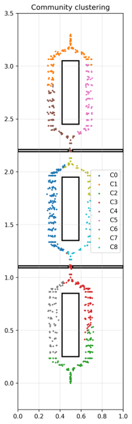
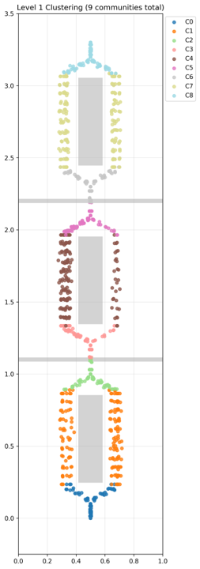
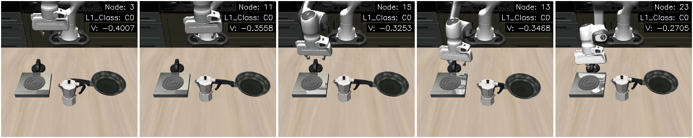
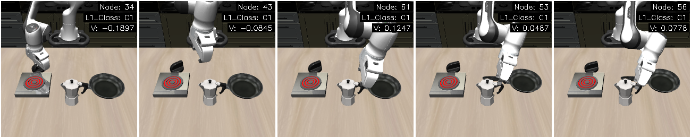
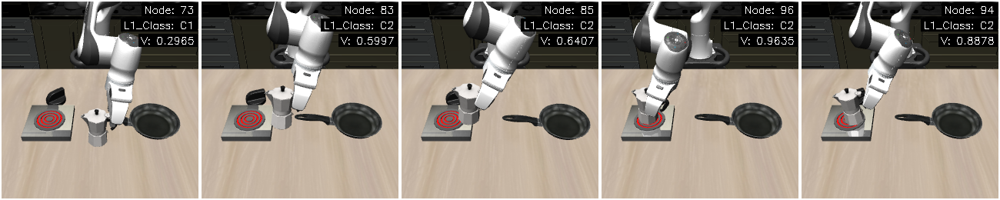
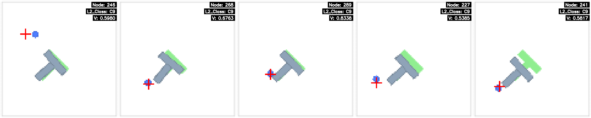
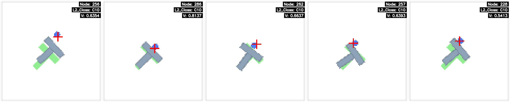
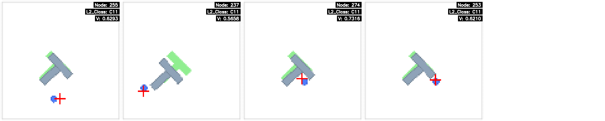

# 🚀 Unsupervised Skill Discovery for Long-Horizon Robotic Tasks
# 🚀 面向长视角机器人任务的无监督技能发现框架

---

## 💡 Overview / 项目概述

This repository provides a preliminary showcase of a data-driven framework designed to autonomously segment and extract skill primitives from long-horizon robotic demonstrations, strictly under **unsupervised conditions**. 

By evaluating datasets and mapping demonstrations without manual annotations, this framework extracts actionable skill primitives that can be seamlessly integrated into Vision-Language-Action (VLA) architectures for advanced logical reasoning and real-world deployment.

本仓库展示了一个完全在**无监督条件**下运行的数据驱动框架，旨在从长视角的机器人专家多模态演示数据中（视觉、位姿等），自动切分并提取出动作技能基元（Skill Primitives）。

该框架无需任何人工标注即可对数据集进行评估和行为映射，从而赋能高层的逻辑推理与实体机器人部署。

---

## 🛠️ Methodology Pipeline / 技术路线概述

  

The framework processes raw, unannotated offline demonstrations through a unified, multi-stage optimization pipeline. Instead of relying on rigid heuristics, the framework sequentially executes:
1. **Progress-Value State Mapping:** Leveraging value-based networks and multi-modal embedding alignments to project high-dimensional states into localized progress dimensions.
2. **Topological Graph Construction:** Utilizing predictive world models and connectivity estimation to construct transition graphs for long-range expert trajectories.
3. **Graph-Based Community Discovery:** Applying non-parametric clustering algorithms to derive structured skill-affinity matrices and isolate behavior modalities.

本框架通过一个统一的、多阶段优化流水线来处理无标注的多模态离线专家演示数据。该方法不依赖于固定的启发式规则，而是依次执行以下核心阶段：
1. **进度-价值状态映射：** 结合价值评估网络与多模态嵌入对齐，将高维状态空间投射到局部任务进度维度。
2. **拓扑转移图构建：** 引入预测世界模型与连通性度量，为长周期专家轨迹构建状态转移图。
3. **图论社区发现：** 运用非参数化聚类算法推导结构化技能亲和矩阵，从而孤立出独特的行为模态。

---

## 📊 Visual Results / 实验结果可视化

Our framework has been successfully evaluated across diverse simulation environments. While the underlying mathematical framework remains unified, different experimental benchmarks explicitly validate the effectiveness of **distinct stages** within our algorithmic pipeline.

本框架已在多种仿真环境中得到成功验证。尽管底层的数学框架是完全统一的，但不同的实验基准分别聚焦并验证了我们算法流水线中**不同阶段**的有效性。

### 1. 2D Navigation: Sub-task Stage & Node Extraction / 2D导航：子任务阶段与核心节点提取
*  This benchmark validates the **state-mapping and early graph-construction stages** against a traditional spatial graph clustering baseline. Note that conventional graph clustering requires explicit 2D spatial coordinates and inherently fails on high-dimensional visual features (which is why our framework is uniquely capable of handling the subsequent PushT and LIBERO tasks). As shown below, our method successfully flattens raw trajectories to cleanly extract fine-grained sub-task stages (parallel paths around obstacles) and structural sub-task nodes (bottleneck doorways), yielding a **33.9% increase in classification accuracy** over the baseline.
*  该基准将我们的方法与传统的空间图聚类基线进行了对比，重点验证了**状态映射与初步图构建阶段**的有效性。需要强调的是，传统图聚类算法严重依赖低维的明确空间坐标，完全无法处理高维视觉特征（这也是为何后续的 PushT 和 LIBERO 任务只能由本框架完成的原因）。如下图所示，相比于基线算法产生的粘连噪声，本框架成功去噪，极其清晰地提取出了细粒度的并行行为模态（绕过障碍物的左右路径）以及结构化的核心子任务节点（狭窄的门），在分类准确率上实现了 **33.9% 的提升**。

  
  &nbsp;&nbsp;&nbsp;&nbsp; 
  
    
  
  
<i><b>Left (Baseline):</b> Traditional graph clustering exhibits severe boundary noise and fails to isolate critical structural bottlenecks.   <b>Right (Ours):</b> Our framework sharply isolates sequential sub-task nodes (e.g., passing through doors) and cleanly separates parallel operational modalities (e.g., navigating left vs. right around obstacles).   <b>左侧（基线算法）：</b> 传统图聚类在边界处出现严重噪声，无法独立剥离出关键的结构化瓶颈节点。 <b>右侧（本文方法）：</b> 我们的框架极其锐利地提取出了时序上的核心子任务节点（如穿过窄门），并完美分离了空间上并行的操作模态（如从障碍物左侧或右侧绕行）。</i>

### 2. LIBERO: Multi-Stage Task Phase Discovery / LIBERO任务：时序任务阶段切分
*  Evaluating the framework on the long-horizon `KITCHEN_SCENE3_turn_on_the_stove_and_put_the_moka_pot_on_it` task from the LIBERO-10 suite demonstrates the efficacy of the **topological graph layering stage**. Despite severe downsampling and varying initial conditions across different demos, the framework robustly segments the dataset into strictly aligned semantic phases based on visual observations, without any temporal annotations. 
*  针对 LIBERO-10 测试集中的特定长周期操纵任务（`KITCHEN_SCENE3_turn_on_the_stove_and_put_the_moka_pot_on_it`）进行评估，展示了算法中**拓扑图层级划分阶段**的有效性。尽管数据经过了下采样，且不同演示轨迹的初始条件各异，框架仍能在无时序标注的情况下，仅依靠视觉观测将整个数据集鲁棒地切分并对齐为严格的语义阶段。

  
<b>Phase 1 (Class C0): Approaching & Turning on the Stove / 接近并打开火炉开关</b>

  
  
   

  
<b>Phase 2 (Class C1): Reaching for the Moka Pot / 转向并准备抓取摩卡壶</b>

  
  
   

  
<b>Phase 3 (Class C2): Placing the Pot on the Stove / 将摩卡壶放置于火炉上</b>

  
  
   
    
  
<i><b>Task Phase Alignment:</b> Each strip represents an autonomously discovered sub-task stage. Images within a strip are randomly sampled from different demonstration trajectories, highlighting the framework's ability to consistently group identical semantic behaviors across visual variances.   <b>任务阶段对齐：</b> 每个长条代表算法无监督发现的一个子任务阶段。长条内的图片是从不同的演示轨迹中随机抽取的，凸显了框架在存在视觉差异的情况下，仍能高度一致地将相同的语义行为进行归类的能力。</i>

### 3. PushT: Behavior Modality Segmentation / PushT任务：行为模态自动识别
*  This visuo-spatial manipulation task highlights the final **graph-based community discovery stage**. Leveraging a rich fusion of visual feedback and physical spatial features, the framework successfully filters local drift noise. More importantly, within a single localized sub-task, it autonomously distinguishes divergent behavior modalities (e.g., alternative pushing trajectories or obstacle-avoidance patterns) for the exact same underlying goal.
*  这一视觉-空间操纵任务重点突出了流水线后期的**图论社区发现阶段**。框架深度融合视觉反馈与物理空间位置特征，不仅有效过滤了局部漂移噪声，更重要的是，在同一个局部子任务内部，它能自适应地识别并分离出完成同一目标的截然不同的行为模态（例如：不同的物理推动路径或避障策略）。

  
<i>The following strips visualize three distinct behavioral modalities discovered for the same target interaction phase.   以下长条图可视化了在同一个目标交互阶段中，算法无监督发现的三种截然不同的行为模态。</i>

  
<b>Modality 1 (Class C9): Top-Down Push / 从物块上方推</b>

  
  
   

  
<b>Modality 2 (Class C10): Bottom-Left Push / 从物块左下角推</b>

  
  
   

  
<b>Modality 3 (Class C11): Bottom-Right Push / 从物块右下角推</b>

  
  
   
  
  
<i><b>Parallel Modality Recognition:</b> Unlike sequential phases, Classes C9, C10, and C11 represent parallel spatial strategies. Columns depict random trajectory samples. The visual consistency within each strip proves the framework's capability to categorize complex visuo-motor actions based on multi-modal topological similarities.   <b>并行模态识别：</b> 与时序阶段不同，C9、C10 和 C11 代表了并行的空间操作策略。即使不同演示的视觉初始状态不同，算法依然能精准地将具有相似拓扑特征的复杂视觉-运动行为归入对应的模态。</i>

 
